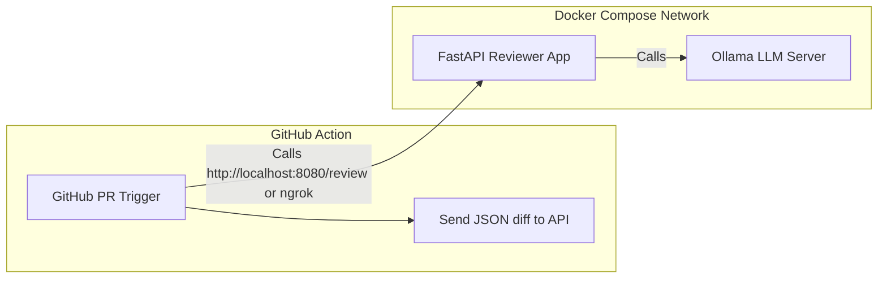

# 🤖 AI PR Reviewer with Ollama, FastAPI & GitHub Actions

Automatically review GitHub pull requests using an open-source LLM (like CodeLlama) with [Ollama](https://ollama.com), a FastAPI-based review server, and GitHub Actions integration.

---

## 📦 Features

- Local AI code reviewer using **Ollama + CodeLlama**
- **FastAPI** backend to generate structured review comments
- **Docker Compose** setup for isolation and reproducibility
- GitHub Actions workflow support
- Can analyze both **diffs** and **full file context**

---

## 🚀 Getting Started

### 1. Clone the repo

```bash
git clone https://github.com/yourusername/ai-pr-reviewer.git
cd ai-pr-reviewer
```

### 2. Build and Run the System

Use Docker Compose to spin up both the LLM and review app:

```bash
make up
```

> This runs:
> - `ollama`: the LLM backend
> - `reviewer`: the FastAPI app

### 3. Pull the Model

Once containers are running:

```bash
make pull-model
```

> Downloads the CodeLlama model into Ollama.

### 4. Run a Local Test

Create `review_payload.json`:

```json
{
  "diff": "---\na+baz = 123\n",
  "full_file": "def foo():\n    return 'bar'\n\nbaz = 123\n",
  "filename": "example.py"
}
```

Then:

```bash
make review
```

---

## 🌍 Exposing API with ngrok (for GitHub Access)

To allow GitHub Actions to call your API:

### Step 1: Install ngrok

[Download ngrok](https://ngrok.com/download) and set it up:

```bash
ngrok config add-authtoken <your_auth_token>
```

### Step 2: Expose the reviewer API

```bash
ngrok http 8080
```

This gives you a public URL like:

```
https://abc123.ngrok.io
```

Use this in your GitHub workflow as the API endpoint.

---

## 🧠 Architecture



---

## 📁 File Structure

```
.
├── app.py                # FastAPI app that calls Ollama and formats comments
├── Dockerfile            # Reviewer service Dockerfile
├── docker-compose.yml    # Compose config
├── Makefile              # Easy commands
├── review_payload.json   # Sample request
└── .github/workflows/pr-review.yml
```

---

## 📜 License

MIT — feel free to use, improve, and contribute!
